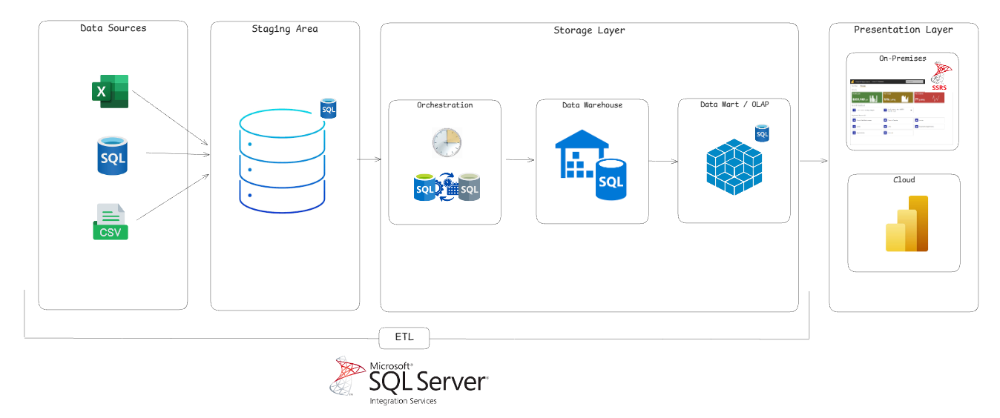

# Zero-Cost Data Warehouse — Fruit Juice BI

An end-to-end Business Intelligence project built entirely on free tooling: Excel/CSV sources are loaded through **SSIS** into a **SQL Server** star-schema data warehouse, exposed through **SSAS Multidimensional (OLAP)** cubes, and visualised in a **Power BI** dashboard.

The case study is *Sucos de Frutas* (Fruit Juice Co.), a beverage manufacturer that needs to analyse revenue, costs, freight and targets by product, customer, factory, sales organisation and time.



## What's inside

| Layer | Folder | Technology | What it does |
|---|---|---|---|
| Sources | [Sources](Sources/README.md) | Excel, CSV, SQL scripts | Raw inputs, helper scripts and a full database backup |
| Data warehouse | [fruit_juice](fruit_juice/README.md) | SQL Server (SSDT database project) | Star-schema DDL: 7 dimensions, 5 fact tables, 1 stored procedure |
| ETL | [ETL](ETL/README.md) | SSIS | Two packages: load dimensions, load facts |
| OLAP | [OLAP](OLAP/README.md) | SSAS Multidimensional | 4 cubes, 5 dimensions with hierarchies |
| Presentation | [Dashboard](Dashboard/README.md) | Power BI | Live-connection report on top of the cubes |
| Documentation | [docs](docs/README.md) | Markdown | Architecture, data model, setup guide, glossary, tutorial |

All projects are loaded by the Visual Studio solution [fruit_juice.sln](fruit_juice.sln).

## Quick start

**Prerequisites** — Windows, SQL Server (Database Engine, Integration Services, Analysis Services in *Multidimensional* mode), Visual Studio 2019 with the SSDT / SSIS / SSAS project extensions, and Power BI Desktop. SQL Server Developer and Express editions and Power BI Desktop are free.

```bash
git clone https://github.com/lorenzouriel/zero-cost-dw.git
cd zero-cost-dw
```

Then follow the [Getting Started guide](docs/getting-started.md): create the database, repoint the SSIS Excel/CSV connections, run the packages, deploy the cubes, open the dashboard.

> **Shortcut:** [Sources/FULL.zip](Sources/FULL.zip) contains a full backup of the populated warehouse (`DW_SUCOS_FULL.bak`) if you only want to explore the cubes and dashboard without running the ETL.

## Documentation

| Document | Contents |
|---|---|
| [Architecture](docs/architecture.md) | Layers, data flow, technology choices |
| [Data model](docs/data-model.md) | Every dimension and fact table, grain, keys, ERD |
| [ETL](docs/etl.md) | Package flow, parameters, source-to-target mapping |
| [OLAP](docs/olap.md) | Cubes, measures, hierarchies, the "complete fact" table |
| [Dashboard](docs/dashboard.md) | Report pages and how it connects |
| [Getting started](docs/getting-started.md) | Step-by-step setup and known gotchas |
| [Glossary](docs/glossary.md) | Portuguese → English name mapping for all objects |
| [Tutorial](docs/tutorial.md) | Full walkthrough of how the project was built (PDF, Portuguese) |

## A note on language

The documentation is in English. The **database objects, SSIS packages, cubes, source files and dashboard labels are still in Portuguese** (`dim.cliente`, `Fato_001`, `Faturamento`, …) because the ETL packages, cubes and the `.pbix` bind to those names. Renaming them means editing each artifact in its Visual Studio designer; until then, use the [glossary](docs/glossary.md) to translate.

## Repository layout

```
.
├── fruit_juice.sln          Visual Studio solution (database + ETL + OLAP)
├── fruit_juice/             SQL Server database project (DDL)
├── ETL/                     SSIS project
├── OLAP/                    SSAS Multidimensional project
├── Sources/                 Raw data, helper scripts, database backup
├── Dashboard/               Power BI report and its background images
└── docs/                    All documentation and diagrams
```

Build output (`bin/`, `obj/`) and Visual Studio state (`.vs/`, `*.user`) are git-ignored.

## Tech stack

Excel · CSV · T-SQL · SQL Server · SSIS · SSAS Multidimensional (MDX) · Power BI Desktop / Service · Visual Studio 2019 · Figma (dashboard backgrounds)
