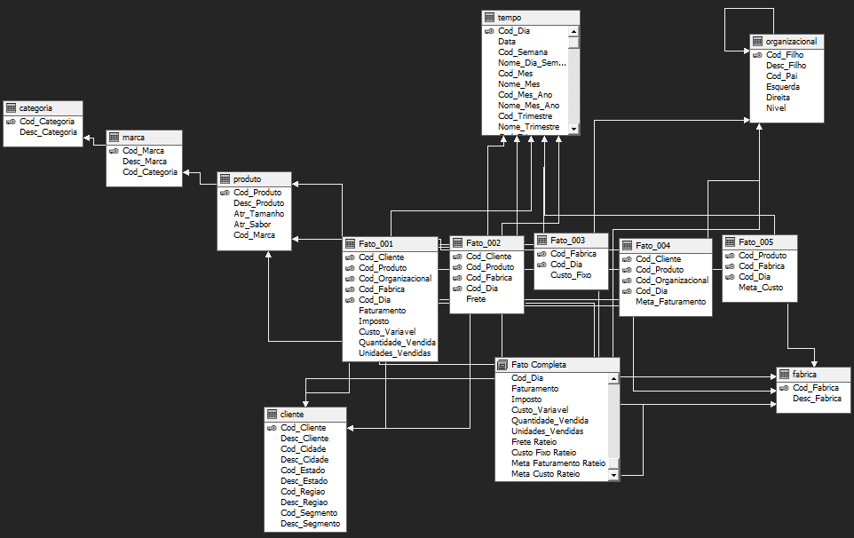

# OLAP (SSAS Multidimensional)

The [OLAP/](../OLAP/) project turns the relational warehouse into cubes. It connects to the `fruit_juice` database through the data source `Fruit Juice.ds` (SQL Native Client, local instance, Windows authentication) and a data source view, `Fruit Juice.dsv`.

## Data source view and the "complete fact" table

Besides the seven dimensions and five fact tables, the data source view contains one extra named object, **Fato Completa** ("complete fact"), related to every dimension and carrying every metric.



### The complete fact table

The five facts sit at different grains, so freight, fixed cost and both targets cannot be broken down by, say, product or customer directly. Fato Completa fixes that by **allocating** each coarse-grain amount down to the sales grain, proportionally to quantity sold:

```
allocated amount = (row quantity sold ÷ total quantity sold in the coarser fact's grain) × amount
```

It exposes four allocated measures alongside the original sales measures:

| Allocated measure | Source fact | Coarser grain |
|---|---|---|
| `Frete Rateio` (freight) | `Fato_002` | customer × product × factory × day |
| `Custo Fixo Rateio` (fixed cost) | `Fato_003` | factory × day |
| `Meta Faturamento Rateio` (revenue target) | `Fato_004` | customer × product × organisation × day |
| `Meta Custo Rateio` (cost target) | `Fato_005` | product × factory × day |

The allocation logic is in `FULL/Rateio.sql`, shipped inside [Sources/FULL.zip](../Sources/README.md); it reads from `DW_SUCOS.dbo.Fato_00n`.

## Cubes

| Cube | Audience | Fact tables | Measures |
|---|---|---|---|
| `VENDAS` (Sales) | Stakeholders | `Fato_001`, `Fato_002`, `Fato_004` | Faturamento, Imposto, Custo Variavel, Quantidade Vendida, Unidades Vendidas, Frete, Meta Faturamento |
| `CUSTOS` (Costs) | Stakeholders | `Fato_001`, `Fato_003`, `Fato_005` | Faturamento, Imposto, Custo Variavel, Quantidade Vendida, Unidades Vendidas, Custo Fixo, Meta Custo |
| `PRESIDENCIA` (Executive) | Presidency / executives | All five facts | Every measure above |
| `COMPLETO` (Complete) | General analysis (not restricted to a group) | `Fato Completa` only | Faturamento, Imposto, Custo Variavel, Quantidade Vendida, Unidades Vendidas, Frete Rateio, Custo Fixo Rateio, Meta Faturamento Rateio, Meta Custo Rateio |

Each fact also exposes an automatic row-count measure (`Fato 00n Count`).

Why split into several cubes: in `VENDAS`, `CUSTOS` and `PRESIDENCIA` the facts keep their native grain, so a measure shows values only along the dimensions its fact is related to (see the [dimensional matrix](data-model.md#dimensional-matrix)). `COMPLETO` trades that purity for the ability to slice every measure by every dimension using allocation.

## Dimensions and hierarchies

| Dimension | Hierarchies |
|---|---|
| `Tempo` (Time) | **Hierarquia do Mês:** Semestre → Trimestre → Mês. **Hierarquia do Mês e Ano:** Semestre-Ano → Trimestre-Ano → Mês-Ano |
| `Cliente` (Customer) | **Hierarquia Geografica:** Região → Estado → Cidade → Cliente. **Hierarquia Segmento:** Segmento → Cliente |
| `Produto` (Product) | **Hierarquia de Produtos:** Categoria → Marca → Produto |
| `Fabrica` (Factory) | **Hierarquia Fabrica:** Fábrica |
| `Organizacional` (Organisation) | Parent-child hierarchy on `Cod_Filho` / `Cod_Pai` |

## Deploying

1. Open `fruit_juice.sln` and set the OLAP project's deployment target to your Analysis Services instance (**Project → Properties → Deployment**).
2. Check the data source `Fruit Juice.ds` points at the SQL Server that holds `fruit_juice`.
3. **Build → Deploy**, then process the database (the deploy step offers this).

The Development configuration stores the connection as `Provider=SQLNCLI11.1;Data Source=.;Integrated Security=SSPI;Initial Catalog=fruit_juice`. Because it uses integrated security, the **Analysis Services service account** must have read access to `fruit_juice`.
