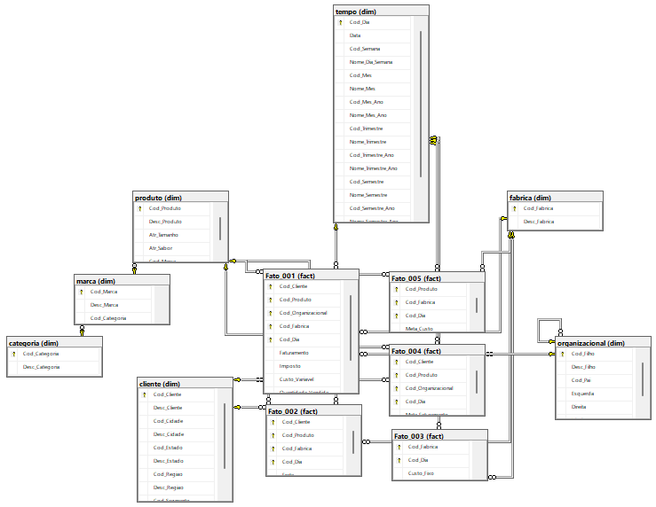

# fruit_juice — Database project

SSDT (SQL Server Data Tools) project that defines the data warehouse: schemas, tables, keys and one stored procedure. Publishing it creates an empty `fruit_juice` database ready for the [ETL](../ETL/README.md).

Full documentation: **[Data model](../docs/data-model.md)**.

## Contents

| Path | What it holds |
|---|---|
| `Schemas/` | `dim`, `fact`, `staging` |
| `Tables/dim/` | `categoria`, `marca`, `produto`, `cliente`, `fabrica`, `organizacional`, `tempo` |
| `Tables/fact/` | `Fato_001` (sales), `Fato_002` (freight), `Fato_003` (fixed cost), `Fato_004` (revenue target), `Fato_005` (cost target) |
| `Stored Procedures/SP_MONTAESQDIR.sql` | Recursive procedure that computes left / right / level for the parent-child `dim.organizacional` |
| `fruit_juice.sqlproj` | Project file (target platform: SQL Server 2016, `Sql130`) |

## Publish

In Visual Studio: right-click the project → **Publish** → set the target database to `fruit_juice`. From the command line, build the project to a `.dacpac` and deploy it with `SqlPackage`.

Object names are in Portuguese; see the [glossary](../docs/glossary.md).
